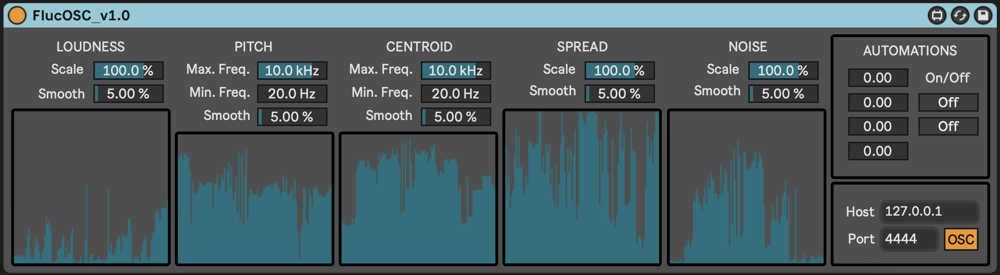

# FlucOSC

FlucOSC is a MaxForLive device designed to extract and transmit live audio descriptors via OSC (Open Sound Control). This tool facilitates seamless integration with external software and systems, enabling real-time analysis and creative applications.

## Setup

1. **Place the Device**: Insert the FlucOSC device on the Ableton Live audio track you wish to analyze.
2. **Configure OSC**: Set the OSC address and port to match the destination software or system.
3. **Explore and Create**: Use the transmitted data in any other software for your creative or analytical needs.

## Credits

FlucOSC was initially developed by [Jean-Philippe Jullin](https://github.com/jpjullin) for the work *Visions Couleurs* as part of the research-creation project *Notation Performative* led by Nicolas Bernier. 

For more information, visit: [https://lfo-lab.ca/notation-performative](https://lfo-lab.ca/notation-performative)
